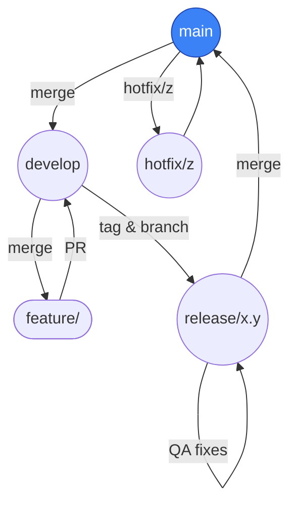

# Git Commit & Branch Standards

> **Baseado exclusivamente em**: *Pro Git, 2ª ed.* (Scott Chacon & Ben Straub)

---

## Pequena descrição

Guia rápido para iniciar e manter um repositório Git de forma **limpa e previsível**: estratégia de branches, padrão de commits, fluxo de hotfix e dicas práticas para o dia a dia.

---

## Branch strategy in a nutshell



### Long‑running branches

| Branch      | Propósito                | Regras básicas                                                                           |
| ----------- | ------------------------ | ---------------------------------------------------------------------------------------- |
| **main**    | Código em produção       | • Somente *fast‑forward*<br>• Cada commit é implantável<br>• Releases são tags assinadas |
| **develop** | Integra features prontas | • CI deve passar antes do merge<br>• Merge via Pull Request                              |

### Short‑lived topic branches

* **feature/⟨issue⟩‑descrição** – novas funcionalidades
* **bugfix/⟨issue⟩‑descrição** – correções não críticas
* **hotfix/⟨versão⟩** – correção urgente (partindo de **main**)

**Exemplos de branches de curta duração**

* `feature/456-login-throttle` – nova funcionalidade (issue #456)
* `bugfix/789-null-pointer-user` – correção de bug não crítico (issue #789)
* `chore/ci-upgrade-node18` – ajuste de infraestrutura/CI
* `docs/update-readme` – melhoria de documentação
* `hotfix/1.2.1-session-overflow` – correção urgente em produção

> Crie · *commite* · PR · delete — branches são baratos, mantenha‑os curtos (≤ 1 semana).

---

## Commit message pattern

```
<50‑caracteres – resumo imperativo>

<Corpo em até 72 colunas explicando o *porquê*>

Footer‑Opcional: refs #issue‑id
```

**Regras‑chave**

1. **Modo imperativo** – “Adiciona cache”, não “Adicionado”.
2. **Explique o motivo**, não só o que mudou.
3. Rode `git diff --check` antes do commit para evitar espaços em branco.

<details>
<summary>Exemplo completo</summary>

```
Implementa cache de pesquisa

Reduz de 400 ms para 40 ms o tempo de resposta da rota /products
armazenando as consultas mais frequentes em Redis. Em caso de falha,
o código volta a consultar o banco normalmente.

Refs: #123
```

</details>

---

## Sugestões práticas

### Configuração inicial

* **Defina `pull.rebase=true`** (`git config --global pull.rebase true`) para evitar merges de *"merge branch origin/develop"*.
* **Aliases úteis** no `~/.gitconfig`:

  ```ini
  [alias]
    lg = log --graph --oneline --decorate --all
    co = checkout
    br = branch
  ```
* **.gitignore global**: adicione `~/.gitignore_global` e configure com `git config --global core.excludesfile ~/.gitignore_global`.

### Automação de qualidade

* **Hooks locais** com [`pre-commit`](https://pre-commit.com/) para rodar linters e testes antes do push.
* **Hook `commit-msg`** integrado ao [Conventional Commits](https://www.conventionalcommits.org/) + `commitlint` para validar mensagens.
* **Proteja `main` e `develop`** no GitHub/GitLab com:

  * Revisão obrigatória
  * CI verde
  * Proibição de *force‑push*

### Fluxo diário de trabalho

1. Atualize sua base:

   ```bash
   git checkout develop
   git pull --rebase
   ```
2. Crie a branch:

   ```bash
   git checkout -b feature/456-login-throttle
   ```
3. Commits pequenos e atômicos (`git add -p`).
4. `git push -u origin HEAD` abre PR já apontando para **develop**.
5. Rebase frequente enquanto a PR está aberta:

   ```bash
   git fetch origin develop
   git rebase origin/develop
   ```
6. Merge squash ou fast‑forward, delete branch remota e local.

### Versionamento & releases

* **Versione via tags semânticas**: `vMAJOR.MINOR.PATCH`.
* Gere *CHANGELOG* automaticamente com [`git‑cliff`](https://git‑cliff.org/) lendo Conventional Commits.
* Após `git tag -s v1.3.0 -m "1.3.0"`, execute `git push origin v1.3.0`.

### Limpeza de branches

* Exclua branches já mescladas:

  ```bash
  git fetch --prune
  git branch --merged develop | grep -v '^*\|main\|develop' | xargs -r git branch -d
  ```
* Use `git gc --aggressive --prune=now` a cada trimestre.

---

## Hotfixes

1. Criar branch a partir de **main**
2. Corrigir e *commit* com mensagem `Patch:`.
3. Tag assinado + merge sem fast‑forward de volta para **main** e **develop**.

   ```bash
   git tag -s v1.2.1 -m "1.2.1 – hotfix"
   git checkout main && git merge --no-ff hotfix/1.2.1
   git checkout develop && git merge --no-ff hotfix/1.2.1
   git push --all --follow-tags
   ```

---

## License

Conteúdo derivado unicamente de *Pro Git* sob **CC BY‑NC‑SA 3.0**.
