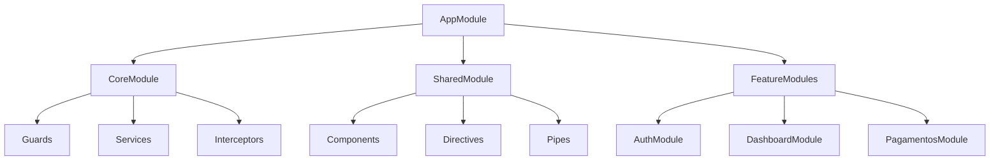
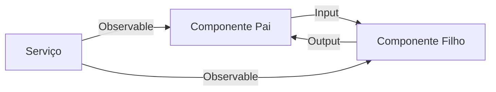
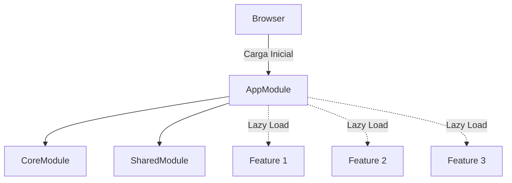
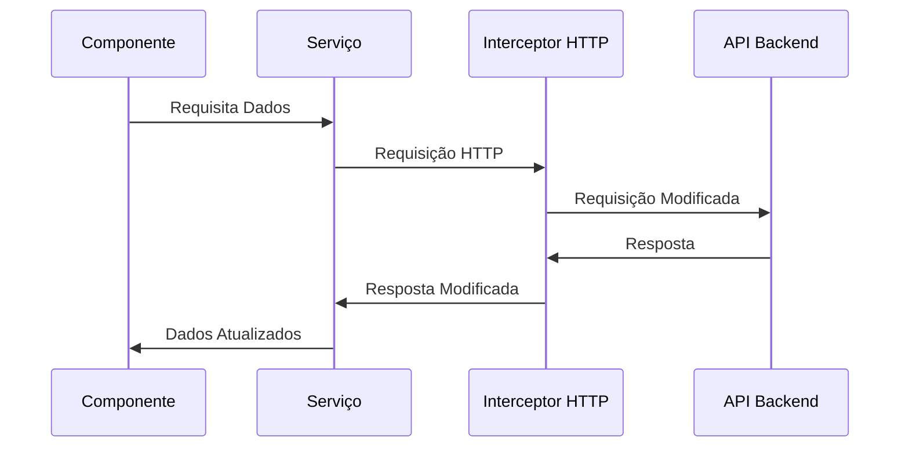
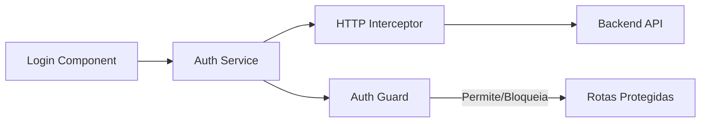
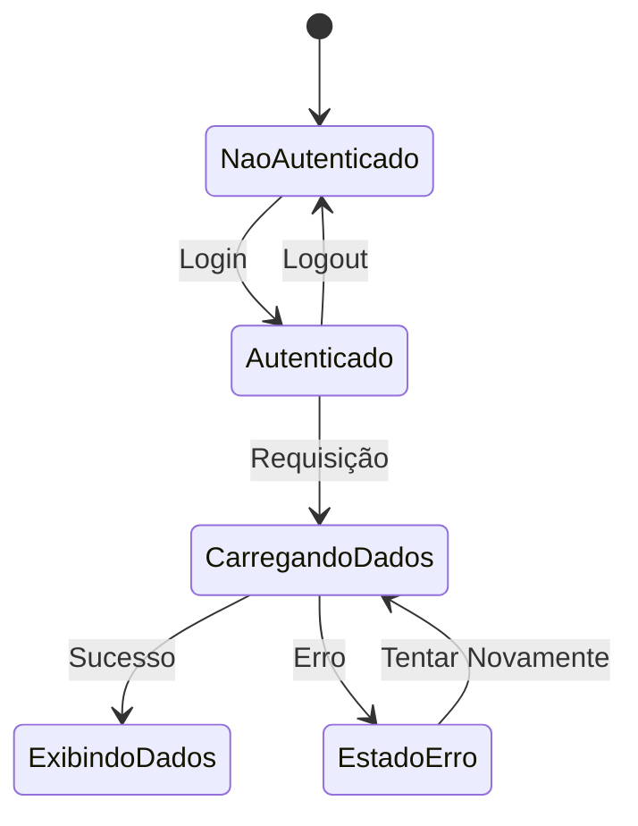

# 🚀 Arquitetura de Projeto Angular

> **Baseado em**: *Angular 17+*  
> Guia de referência para criar projetos escaláveis, performáticos e fáceis de manter.

## Índice
1. [Estrutura do Projeto](#estrutura-do-projeto)
2. [Diagramas de Arquitetura](#diagramas-de-arquitetura)
3. [Módulos Principais](#módulos-principais)
4. [Boas Práticas](#boas-práticas)
5. [Exemplos Práticos](#exemplos-práticos)

## Estrutura do Projeto

### Organização de Diretórios

```typescript
src/
├── app/
│   ├── core/                    # Serviços e funcionalidades globais
│   ├── shared/                  # Componentes e utilitários compartilhados
│   ├── layout/                  # Templates e layouts base
│   ├── features/               # Módulos funcionais da aplicação
│   └── app.module.ts           # Módulo raiz
```

## Diagramas de Arquitetura

### Estrutura de Módulos


### Fluxo de Comunicação


### Estrutura Lazy Loading


### Fluxo de Dados


### Fluxo de Autenticação


### Estado da Aplicação


## Módulos Principais

### Core Module (`/core`)
- **Propósito**: Serviços singleton e utilitários globais
- **Componentes**:
  - Guards de autenticação
  - Interceptors HTTP
  - Serviços globais
  - Modelos de dados (interfaces)

### Shared Module (`/shared`)
- **Componentes Reutilizáveis**:
  - Formulários customizados
  - Componentes UI (Botões, Cards, etc)
  - Pipes personalizados
  - Diretivas

### Layout Module (`/layout`)
- **Estruturas de Layout**:
  ```typescript
  layout/
  ├── auth-layout/              # Layout para páginas de autenticação
  └── app-layout/              # Layout para área logada
      ├── header/
      └── sidebar/
  ```

### Features Module (`/features`)
- **Módulos Funcionais**:
  ```typescript
  features/
  ├── auth/                    # Autenticação
  ├── dashboard/              # Painéis
  ├── pagamentos/            # Módulo de pagamentos
  └── configuracoes/         # Configurações
  ```

## Boas Práticas

### 1. Nomenclatura
- Arquivos: `feature-name.component.ts`
- Classes: `FeatureNameComponent`
- Seletores: `app-feature-name`

### 2. Lazy Loading
```typescript
const routes: Routes = [
  {
    path: 'feature',
    loadChildren: () => import('./features/feature/feature.module')
      .then(m => m.FeatureModule)
  }
];
```

### 3. Organização de Serviços
```typescript
// core/services/auth.service.ts
@Injectable({
  providedIn: 'root'
})
export class AuthService {
  // Implementação
}
```

## Exemplos Práticos

### Componente Compartilhado
```typescript
// shared/components/input/input.component.ts
@Component({
  selector: 'app-input',
  template: `
    <div class="input-wrapper">
      <label>{{label}}</label>
      <input [formControlName]="controlName">
    </div>
  `
})
export class InputComponent {
  @Input() label: string;
  @Input() controlName: string;
}
```

### Feature Module
```typescript
// features/dashboard/dashboard.module.ts
@NgModule({
  imports: [
    CommonModule,
    SharedModule,
    DashboardRoutingModule
  ],
  declarations: [
    DashboardComponent,
    DashboardWidgetComponent
  ]
})
export class DashboardModule { }
```

### Estrutura de Testes
```typescript
// feature.component.spec.ts
describe('FeatureComponent', () => {
  beforeEach(async () => {
    await TestBed.configureTestingModule({
      declarations: [ FeatureComponent ],
      imports: [ SharedModule ]
    }).compileComponents();
  });

  it('deve criar o componente', () => {
    const fixture = TestBed.createComponent(FeatureComponent);
    expect(fixture.componentInstance).toBeTruthy();
  });
});
```

## Dicas de Performance

1. **Detecção de Mudanças**
   - Use `ChangeDetectionStrategy.OnPush`
   - Implemente `trackBy` em *ngFor

2. **Otimização de Módulos**
   - Lazy loading em rotas
   - Pré-carregamento estratégico

3. **Gerenciamento de Estado**
   - Utilize serviços com BehaviorSubject
   - Considere NgRx para apps complexos

---

Esta estrutura promove:
- Manutenibilidade
- Escalabilidade
- Reutilização de código
- Separação clara de responsabilidades
