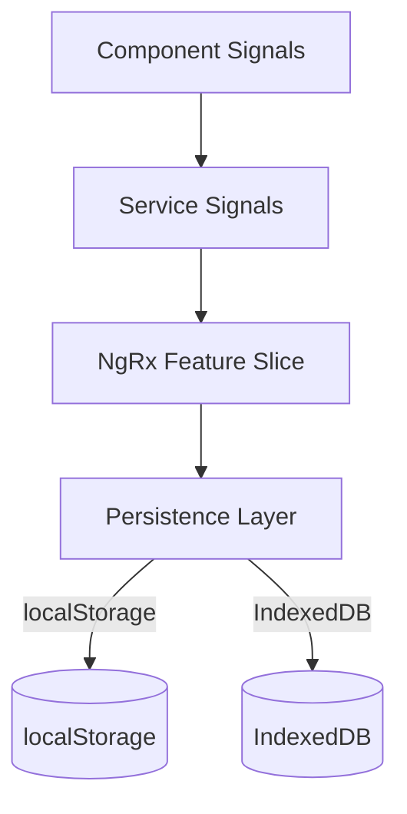

# 📦 Gerenciamento de Estado & Persistência em Angular

> **Objetivo:** escolher a estratégia certa (Signals, localStorage, NgRx, IndexedDB) e manter estado consistente — até em formulários complexos e multi‑steps — sem sacrificar performance ou DX.

---

## 📑 Índice

1. [Visão Geral](#visão-geral)
2. [Camadas de Estado](#camadas-de-estado)
3. [Persistência: localStorage vs IndexedDB](#persistência-localstorage-vs-indexeddb)
4. [NgRx + Meta‑Reducers](#ngrx--meta-reducers)
5. [Caso de Uso: Formulário Multi‑Step Avançado](#caso-de-uso-formulário-multi-step-avançado)
6. [Exemplos Práticos](#exemplos-práticos)
7. [Testes de Estado](#testes-de-estado)
8. [Boas Práticas](#boas-práticas)
9. [Referências](#referências)

---

## 🚦 Visão Geral

| 🏷️ Nível             | 🛠️ Ferramenta                     | 🕒 Quando usar                                                            |
| -------------------- | --------------------------------- | ------------------------------------------------------------------------- |
| **Local**            | `signal()` \| `ComponentStore`   | Pequenos formulários, UI estadual                                         |
| **Compartilhado**    | **Service with Signals**           | Dados usados por vários componentes, sem histórico complexo               |
| **Global**           | **NgRx Store**                     | Várias features dependem de estado sincronizado, time grande, DevTools    |
| **Persistente**      | **localStorage / IndexedDB**       | Sobreviver a reload, offline ou dados > 5 MB (IndexedDB)                  |

> ⚡ **Regra de Ouro**: comece simples (**Signals**) → evolua para NgRx **só** quando múltiplas features precisarem de coordenação ou time requisitar time‑travel debugging.

---

## 🏗️ Camadas de Estado



1. **Component Signals** — UI imediata, descartável ao navegar.
2. **Service Signals / ComponentStore** — compartilhado dentro de uma feature.
3. **NgRx Slice** — fonte única de verdade; animação de DevTools.
4. **Persistence Layer** — Meta‑reducers ou serviços que salvam/recuperam.

---

## 💾 Persistência: localStorage vs IndexedDB

| Critério         | localStorage             | IndexedDB                          |
| ---------------- | ------------------------ | ---------------------------------- |
| Capacidade       | ~5 MB                    | 50 MB+                             |
| API              | Síncrona                 | Assíncrona (Promise)               |
| Tamanho de dados | Strings pequenas         | Objetos grandes, blobs             |
| Suporte SSR      | Precisa *guards*         | Precisa injeção condicional        |
| Exemplos         | Tema, token, wizard step | Cache de catálogos, drafts offline |

> **Recomendação:**
>
> - Use **localStorage** para chaves pequenas e leitura rápida (até 200 ms).
> - Use **IndexedDB** via wrapper (`idb` ou `ngx-indexed-db`) para grandes coleções ou cache offline.

---

## 🏢 NgRx + Meta‑Reducers

```ts
import { ActionReducer, MetaReducer } from '@ngrx/store';
import { RootState } from './index';

export function persistToLocalStorage(reducer: ActionReducer<RootState>): ActionReducer<RootState> {
  return (state, action) => {
    const next = reducer(state, action);
    // Persistir apenas slices selecionados
    localStorage.setItem('formState', JSON.stringify({ form: next.form }));
    return next;
  };
}

export const metaReducers: MetaReducer[] = [persistToLocalStorage];
```

*Deserializar* no `APP_INITIALIZER` ou em `provideState()`

```ts
const initial = JSON.parse(localStorage.getItem('formState') ?? '{}');
provideState(formFeature, { initialState: { ...formFeature.initialState, ...initial.form } });
```

---

## 🧩 Caso de Uso: Formulário Multi‑Step Avançado

> **Contexto:** wizard de aplicação de crédito com 4 passos, 30+ campos, dependências cruzadas (ex.: renda influencia limite), e recálculos (juros, parcelas) em tempo real.

### 🎯 Requisitos

1. **Auto‑save** a cada 3 s (debounce) no localStorage.
2. Recuperar dados se usuário recarregar a página.
3. Manter histórico no NgRx DevTools.
4. Validar dependências (idade >= 18, renda vs parcela).
5. Recalcular valores no **`calculateLoan`** service sempre que `amount` ou `installments` mudar.

### 🗂️ Arquitetura

```text
features/loan-application/
├─ +state/               # NgRx slice
│   ├─ loan.actions.ts
│   ├─ loan.reducer.ts
│   └─ loan.selectors.ts
├─ pages/
│   └─ wizard.page.ts
├─ components/
│   ├─ step-personal-info/
│   ├─ step-finance/
│   └─ summary-card/
└─ services/
    └─ loan-calculator.service.ts
```

- `+state` isolado para a feature.
- Cada **step component** recebe apenas parte do formulário via `@Input()` **signal**.
- Calculadora de empréstimo injetada e pura (sem dependências Angular).
- Meta‑reducer persiste somente `loan.form` slice.

---

## 💡 Exemplos Práticos

### 1. Slice de Estado do Formulário

```ts
export interface LoanFormState {
  step: number;
  data: {
    amount: number;
    installments: number;
    income: number;
    birthDate: string;
    // ...
  };
  calculated: {
    interestRate: number;
    monthlyPayment: number;
  };
}

const initialState: LoanFormState = {
  step: 1,
  data: {} as any,
  calculated: {} as any
};

export const loanFeature = createFeature({
  name: 'loan',
  reducer: createReducer(
    initialState,
    on(nextStep, (state) => ({ ...state, step: state.step + 1 })),
    on(updateField, (state, { path, value }) => update(state, {
      data: { [path]: { $set: value } }
    })),
    on(recalculate, (state, { result }) => ({ ...state, calculated: result }))
  )
});
```

### 2. Auto‑save com Debounce (Signal)

```ts
const formSignal = signal<FormGroup>(this.fb.group(schema));

autocompleteEffect(formSignal, { debounce: 3000 }, (value) => {
  localStorage.setItem('loan-draft', JSON.stringify(value));
});
```

### 3. IndexedDB como Fallback

```ts
import { openDB } from 'idb';

@Injectable({ providedIn: 'root' })
export class DraftStorage {
  private db$ = from(openDB('loan-app', 1, {
    upgrade(db) {
      db.createObjectStore('drafts');
    }
  }));

  saveDraft(id: string, data: unknown) {
    return this.db$.pipe(switchMap(db => db.put('drafts', data, id)));
  }
}
```

### 4. Cross‑Field Validator Example

```ts
export const paymentValidator: ValidatorFn = (group) => {
  const amount = group.get('amount')!.value;
  const installments = group.get('installments')!.value;
  const maxInstallment = amount / 3;
  return installments > maxInstallment ? { excessiveInstallment: true } : null;
};
```

### 5. Busca de CEP performática com RxJS

> 🔎 **Problema:** Toda vez que o usuário digita um número no campo de CEP, uma chamada é feita à API. Isso pode sobrecarregar o backend e gerar má experiência.
>
> 💡 **Solução:** Use `debounceTime` + `switchMap` do RxJS para garantir que apenas a última busca seja executada, reduzindo chamadas desnecessárias.

```ts
import { FormControl } from '@angular/forms';
import { debounceTime, distinctUntilChanged, switchMap } from 'rxjs/operators';
import { CepService } from './cep.service';

cepControl = new FormControl('');

ngOnInit() {
  this.cepControl.valueChanges.pipe(
    debounceTime(400), // espera o usuário parar de digitar
    distinctUntilChanged(),
    switchMap(cep => this.cepService.buscarCep(cep))
  ).subscribe(result => {
    // Atualiza o formulário com o resultado do CEP
  });
}
```

> **Vantagens:**
> - Menos requisições ao backend
> - Resposta sempre atualizada
> - Experiência de usuário mais fluida

---

## 🧪 Testes de Estado

| Teste        | Foco                         | Exemplo                                                            |
| ------------ | ---------------------------- | ------------------------------------------------------------------ |
| **Reducer**  | Garantir transições corretas | `expect(loanReducer(state, nextStep())).toHaveProperty('step', 2)` |
| **Selector** | Memoização e derivados       | `expect(selectMonthlyPayment.projector(mockState)).toBe(500)`      |
| **Effect**   | Side‑effects & debounces     | Marble tests com `jasmine-marbles`                                 |

---

## 🏅 Boas Práticas

1. **Persist only what you need** — salve tags mínimas (evite PII desnecessária).
2. **Versão de schema** — inclua `draftVersion` no storage para migrações.
3. **Limpeza automática** — expira drafts após N dias ou submissão concluída.
4. **Loading indicador** — mostre spinner ao restaurar drafts grandes (IndexedDB).
5. **Error boundaries** — se desserialização falhar, limpe storage e continue.

---

## 📚 Referências

* [Angular Signals RFC](https://github.com/angular/angular/discussions/49639)
* [NgRx Docs – Meta‑Reducers](https://ngrx.io/guide/store/metareducers)
* [Jeremy Elbourn – "State Management Patterns"](https://www.youtube.com/watch?v=6mTbuzafcII)
* [Jake Archibald – IndexedDB 2.0 Guide](https://developers.google.com/web/ilt/pwa/working-with-indexeddb)
