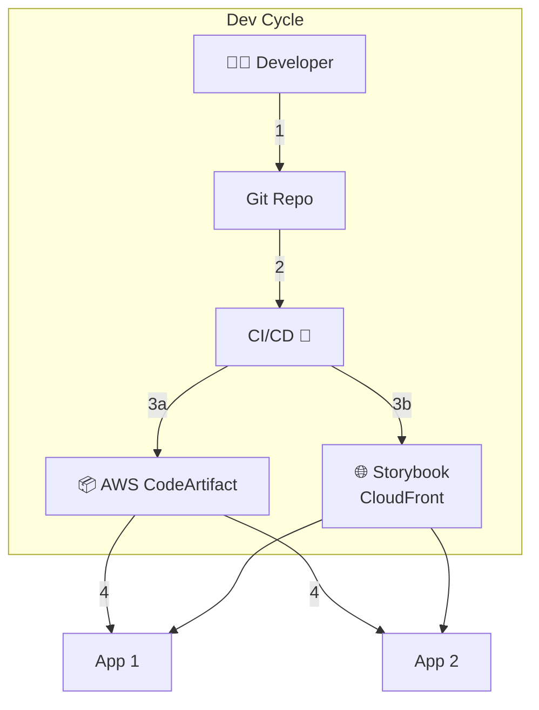

# 📖 Storybook & Design System Publishing Flow

> **Objetivo**: documentar um pipeline enxuto para compilar, testar e publicar o Design System em formato **npm library** (AWS CodeArtifact) e **Storybook static site** (AWS CloudFront), mantendo os consumidores sempre atualizados.

---

## 📑 Índice

1. [Visão Geral](#visão-geral)
2. [Diagrama de Fluxo](#diagrama-de-fluxo)
3. [Etapas Detalhadas](#etapas-detalhadas)
4. [Setup do Repositório](#setup-do-repositório)
5. [Pipeline CI/CD](#pipeline-cicd)
6. [Consumindo a Lib](#consumindo-a-lib)
7. [Boas Práticas](#boas-práticas)
8. [Referências](#referências)

---

## Visão Geral

Este fluxo automatiza **do commit ao consumo**:

1. **Commit** no Git → dispara CI.
2. CI roda **build + testes**.
3. **Publishing**:

   * ***Design System Library*** (package) → **AWS CodeArtifact**.
   * ***Storybook estático*** → **S3** (origin) + **CloudFront** (CDN).
4. Aplicações consumidoras instalam a versão fixa do pacote (`^x.y.z`) e navegam na documentação por CloudFront.

---

## Diagrama de Fluxo


```mermaid
graph TD
  subgraph Dev Cycle
    A[👩‍💻 Developer] -->|1| B[Git Repo]
    B -->|2| C[CI/CD 🚀]
    C -->|3a| D[📦 AWS CodeArtifact]
    C -->|3b| E[🌐 Storybook<br>CloudFront]
  end
  D -->|4| G[App 1]
  D -->|4| H[App 2]
  E --> G
  E --> H

  classDef num fill:#f59e0b,stroke:#b45309,color:#fff,stroke-width:2px;
```

> **Legenda** (canto inferior direito)
>
> * **Círculos numerados** → etapas sequenciais.
> * **Caixas com ícones** → entidades do fluxo.
> * **Setas** → direção de dependência ou entrega.

---

## Etapas Detalhadas

| #      | Etapa       | Descrição                                                                                                      |
| ------ | ----------- | -------------------------------------------------------------------------------------------------------------- |
| **1**  | Commit      | Dev faz push na branch `main` ou abre PR para `develop`.                                                       |
| **2**  | Armazenar   | Repo gerencia código-fonte + Storybook stories.                                                                |
| **3a** | Publish Lib | CI executa `npm publish --registry $CODE_ARTIFACT_URL`.                                                        |
| **3b** | Deploy Docs | `nx run design-system:storybook:build` → `aws s3 sync` → Invalida CloudFront.                                  |
| **4**  | Consumo     | Apps instalam `@org/design-system@^x.y.z` e acessam docs via [https://ds.example.com](https://ds.example.com). |

---

## Setup do Repositório

```
libs/design-system/
├─ src/
│  ├─ button/
│  └─ input/
├─ .storybook/
└─ project.json (Nx) | angular.json (Angular CLI)
```

* Storybook stories ficam lado a lado do componente (`button.stories.ts`).
* `package.json` possui `publishConfig.registry` apontando para CodeArtifact.
* Versão controlada por **Conventional Commits** + `standard-version`.

---

## Pipeline CI/CD

### Exemplo GitHub Actions (simplificado)

```yaml
name: Design System CI

on:
  push:
    branches: [main]
  pull_request:
    paths: ['libs/design-system/**']

jobs:
  build-test:
    runs-on: ubuntu-latest
    steps:
      - uses: actions/checkout@v4
      - uses: pnpm/action-setup@v2
      - run: pnpm install --frozen-lockfile
      - run: pnpm build:design-system && pnpm test:design-system

  publish:
    needs: build-test
    if: github.ref == 'refs/heads/main'
    runs-on: ubuntu-latest
    steps:
      - uses: actions/checkout@v4
      - uses: aws-actions/configure-aws-credentials@v2
        with:
          role-to-assume: ${{ secrets.AWS_CI_ROLE }}
          aws-region: us-east-1
      - run: pnpm run release # semantic-release -> npm publish CodeArtifact

  storybook-deploy:
    needs: publish
    runs-on: ubuntu-latest
    steps:
      - uses: actions/checkout@v4
      - run: pnpm build:storybook
      - run: aws s3 sync ./storybook-static s3://ds-storybook-bucket --delete
      - run: aws cloudfront create-invalidation --distribution-id E123456 --paths '/*'
```

---

## Consumindo a Lib

```sh
# .npmrc do consumidor
@org:registry=https://aws_codeartifact_us-east-1.amazonaws.com/npm/myrepo/
//aws_codeartifact_us-east-1.amazonaws.com/npm/myrepo/:always-auth=true
//aws_codeartifact_us-east-1.amazonaws.com/npm/myrepo/:_authToken=${CODEARTIFACT_AUTH_TOKEN}

# instalação
pnpm add @org/design-system@^1.2.0
```

No `angular.json` ou `tsconfig.json`, nenhuma configuração extra — componentes são **stand‑alone** e usam SSR-friendly styles.

---

## Boas Práticas

1. **Versão semântica** — `major.minor.patch`; faça **release automático** no merge para `main`.
2. **Changelog** — gerado via `semantic-release` + plugins Conventional Commits.
3. **Storybook A11y addon** — garanta acessibilidade por componente.
4. **Playroom / Histoire** — opcionais para playground de props.
5. **Cache em CI** — use `pnpm-store` e `storybook-static` no GitHub Actions cache.

---

## Referências

* AWS CodeArtifact Docs – Publishing npm packages
* AWS CloudFront + S3 – Static website best practices
* Storybook Docs – Continuous Deployment
* "Design System CI/CD" – talk by Brad Frost
