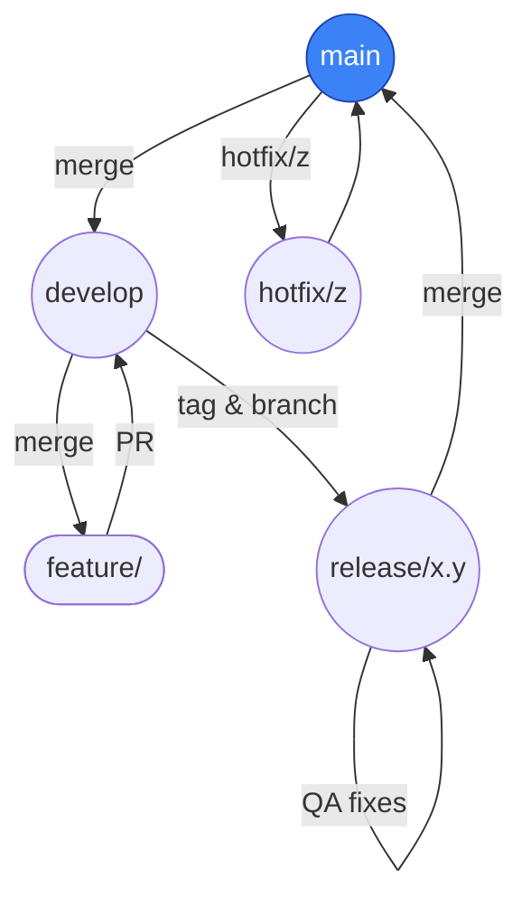

# Padrões de Commit e Branch no Git

> **Baseado exclusivamente em**: *Pro Git, 2ª ed.* (Scott Chacon & Ben Straub)

Um guia completo para manter um repositório Git limpo, eficiente e bem organizado. Este documento abrange estratégias de branches, padrões de commits, padrões de fluxo de trabalho e dicas práticas diárias que ajudam as equipes a colaborar efetivamente.

## Índice

1. [Estratégia de Branches](#branch-strategy-in-a-nutshell)
2. [Padrão de Mensagens de Commit](#commit-message-pattern)
3. [Dicas Práticas](#sugestões-práticas)
4. [Correções de Emergência](#hotfixes)
5. [Operações Avançadas do Git](#advanced-git-operations)
6. [Melhores Práticas](#best-practices)

---

## Descrição

Guia rápido para iniciar e manter um repositório Git de forma **limpa e previsível**: estratégia de branches, padrão de commits, fluxo de hotfix e dicas práticas para o dia a dia.

---

## Estratégia de Branches em resumo



### Branches de Longa Duração

| Branch      | Propósito                | Regras Básicas                                                                           |
| ----------- | ------------------------ | ---------------------------------------------------------------------------------------- |
| **main**    | Código em produção       | • Somente *fast‑forward*<br>• Cada commit é implantável<br>• Releases são tags assinadas |
| **develop** | Integra features prontas | • CI deve passar antes do merge<br>• Merge via Pull Request                              |

### Branches de Tópico (Curta Duração)

* **feature/⟨issue⟩‑descrição** – novas funcionalidades
* **bugfix/⟨issue⟩‑descrição** – correções não críticas
* **hotfix/⟨versão⟩** – correção urgente (partindo de **main**)

**Exemplos de Branches de Curta Duração**

* `feature/456-limite-login` – nova funcionalidade (issue #456)
* `bugfix/789-erro-pointer-usuario` – correção de bug não crítico (issue #789)
* `chore/ci-atualizacao-node18` – ajuste de infraestrutura/CI
* `docs/atualizacao-readme` – melhoria de documentação
* `hotfix/1.2.1-erro-sessao` – correção urgente em produção

> Crie · Faça commit · PR · Delete — branches são baratos, mantenha‑os curtos (≤ 1 semana).

---

## Padrão de Mensagens de Commit

```
<50‑caracteres – resumo imperativo>

<Corpo em até 72 colunas explicando o *porquê*>

Rodapé‑Opcional: refs #issue‑id
```

**Regras Principais**

1. **Modo imperativo** – "Adiciona cache", não "Adicionado".
2. **Explique o motivo**, não só o que mudou.
3. Rode `git diff --check` antes do commit para evitar espaços em branco.

<details>
<summary>Exemplo completo</summary>

```
Implementa cache de pesquisa

Reduz de 400 ms para 40 ms o tempo de resposta da rota /products
armazenando as consultas mais frequentes em Redis. Em caso de falha,
o código volta a consultar o banco normalmente.

Refs: #123
```

</details>

**Exemplos de Mensagens de Commit**

1. Commit de feature:
```
Adiciona limite de requisições no endpoint de login

Implementa limitação baseada em IP (100 req/hora) para prevenir
ataques de força bruta no endpoint de autenticação. Utiliza Redis
para rastrear contagem de requisições.

Refs: #234
```

2. Commit de correção:
```
Corrige vazamento de memória no pool de conexões

As conexões do banco de dados não estavam sendo fechadas
corretamente após timeout, causando esgotamento de recursos
sob alta carga. Adicionada limpeza adequada no wrapper de conexão.

Fixes: #567
```

3. Commit de refatoração:
```
Refatora fluxo de autenticação de usuário

Extrai lógica de autenticação para um serviço dedicado para
melhorar manutenibilidade e permitir futura integração com
outros provedores de autenticação.

Refs: #789
Related: #432
```

4. Commit de documentação:
```
Atualiza documentação da API com informações de limite

Adiciona informações sobre os novos cabeçalhos de limite de
requisições e respostas de erro na documentação da API.

Docs: #890
```

**Integração com Conventional Commits**

Para projetos usando [Conventional Commits](https://www.conventionalcommits.org/):

```
<tipo>[escopo opcional]: <descrição>

[corpo opcional]

[rodapé(s) opcional]
```

Tipos comuns:
- feat: Nova funcionalidade
- fix: Correção de bug
- docs: Documentação apenas
- style: Alterações de estilo de código
- refactor: Refatoração de código
- perf: Melhorias de performance
- test: Adição/correção de testes
- chore: Tarefas de manutenção

Exemplo:
```
feat(auth): implementa login social OAuth2

Adiciona suporte para autenticação OAuth2 via Google e GitHub.
Inclui:
- Configuração do cliente OAuth2
- Mapeamento de perfil de usuário
- Atualizações no gerenciamento de sessão

BREAKING CHANGE: Endpoints de autenticação agora retornam tokens
JWT em vez de cookies de sessão.

Refs: #901
```

---

## Sugestões práticas

### Configuração inicial

* **Defina `pull.rebase=true`** (`git config --global pull.rebase true`) para evitar merges de *"merge branch origin/develop"*.
* **Aliases úteis** no `~/.gitconfig`:

  ```ini
  [alias]
    lg = log --graph --oneline --decorate --all
    co = checkout
    br = branch
  ```
* **.gitignore global**: adicione `~/.gitignore_global` e configure com `git config --global core.excludesfile ~/.gitignore_global`.

### Automação de qualidade

* **Hooks locais** com [`pre-commit`](https://pre-commit.com/) para rodar linters e testes antes do push.
* **Hook `commit-msg`** integrado ao [Conventional Commits](https://www.conventionalcommits.org/) + `commitlint` para validar mensagens.
* **Proteja `main` e `develop`** no GitHub/GitLab com:

  * Revisão obrigatória
  * CI verde
  * Proibição de *force‑push*

### Fluxo diário de trabalho

1. Atualize sua base:

   ```bash
   git checkout develop
   git pull --rebase
   ```
2. Crie a branch:

   ```bash
   git checkout -b feature/456-login-throttle
   ```
3. Commits pequenos e atômicos (`git add -p`).
4. `git push -u origin HEAD` abre PR já apontando para **develop**.
5. Rebase frequente enquanto a PR está aberta:

   ```bash
   git fetch origin develop
   git rebase origin/develop
   ```
6. Merge squash ou fast‑forward, delete branch remota e local.

### Versionamento & releases

* **Versione via tags semânticas**: `vMAJOR.MINOR.PATCH`.
* Gere *CHANGELOG* automaticamente com [`git‑cliff`](https://git‑cliff.org/) lendo Conventional Commits.
* Após `git tag -s v1.3.0 -m "1.3.0"`, execute `git push origin v1.3.0`.

### Limpeza de branches

* Exclua branches já mescladas:

  ```bash
  git fetch --prune
  git branch --merged develop | grep -v '^*\|main\|develop' | xargs -r git branch -d
  ```
* Use `git gc --aggressive --prune=now` a cada trimestre.

---

## Correções de Emergência

1. Criar branch a partir de **main**
2. Corrigir e *commit* com mensagem `Patch:`.
3. Tag assinado + merge sem fast‑forward de volta para **main** e **develop**.

   ```bash
   git tag -s v1.2.1 -m "1.2.1 – hotfix"
   git checkout main && git merge --no-ff hotfix/1.2.1
   git checkout develop && git merge --no-ff hotfix/1.2.1
   git push --all --follow-tags
   ```

---

## Operações Avançadas do Git

### Resolvendo Conflitos

1. **Prevenção**:
   * Rebases frequentes (`git pull --rebase`) reduzem conflitos
   * Mantenha branches de feature com vida curta
   * Divida grandes mudanças em PRs menores

2. **Passos para Resolução**:
   ```bash
   git status                    # Verifica arquivos em conflito
   git checkout --ours file.txt  # Aceita nossas mudanças
   git checkout --theirs file.txt # Aceita mudanças deles
   git add file.txt             # Marca como resolvido
   ```

3. **Usando Ferramentas Visuais**:
   * `git mergetool` com ferramentas configuradas como VSCode
   * `git config --global merge.tool vscode`

### Operações Interativas

* **Rebase Interativo**:
  ```bash
  git rebase -i HEAD~3  # Rebase dos últimos 3 commits
  ```

* **Staging Interativo**:
  ```bash
  git add -p  # Stage mudanças por hunks
  ```

* **Operações com Stash**:
  ```bash
  git stash push -m "WIP: feature"  # Salva mudanças
  git stash list                    # Lista stashes
  git stash pop                     # Aplica e remove stash
  ```

## Melhores Práticas

### Diretrizes para Code Review

1. **Antes de Submeter PR**:
   * Rebase com o último develop
   * Execute todos os testes localmente
   * Revise seu próprio diff (`git diff develop`)

2. **Tamanho do PR**:
   * Mantenha abaixo de 400 linhas quando possível
   * Divida features grandes em PRs menores
   * Use PRs em draft para feedback antecipado

### Práticas de Segurança

1. **Dados Sensíveis**:
   * Use `.gitignore` para secrets
   * Configure gitignore global:
     ```bash
     git config --global core.excludesfile ~/.gitignore_global
     ```
   * Use hooks pre-commit para prevenir secrets

2. **Assinatura**:
   * Assine todos os commits:
     ```bash
     git config --global commit.gpgsign true
     ```
   * Assine todas as tags:
     ```bash
     git config --global tag.gpgSign true
     ```

### Aliases Úteis Adicionais

```ini
[alias]
    # Visualizações melhoradas de log
    ls = log --pretty=format:"%C(yellow)%h%Cred%d %Creset%s%Cblue [%cn]" --decorate
    ll = log --pretty=format:"%C(yellow)%h%Cred%d %Creset%s%Cblue [%cn]" --decorate --numstat
    
    # Status e diff
    st = status -sb
    df = diff --word-diff
    
    # Operações com branches
    ba = branch -a
    bd = branch -d
    
    # Operações de commit
    ca = commit -a
    cm = commit -m
    amend = commit --amend --no-edit
```

---

## Licença

Conteúdo derivado unicamente de *Pro Git* sob **CC BY‑NC‑SA 3.0**.
